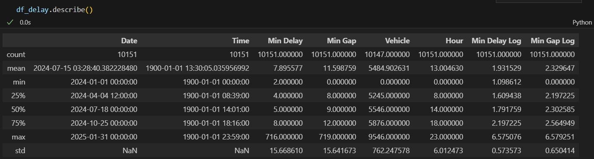
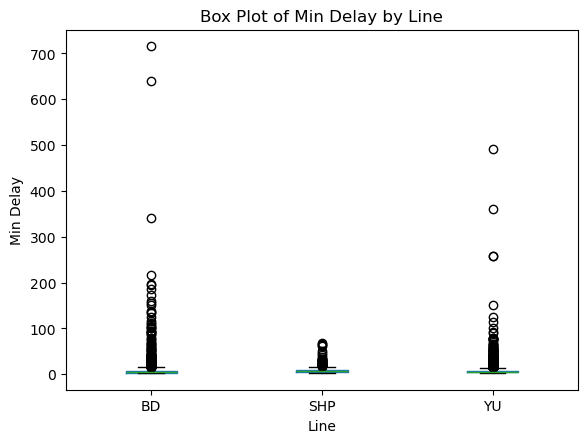
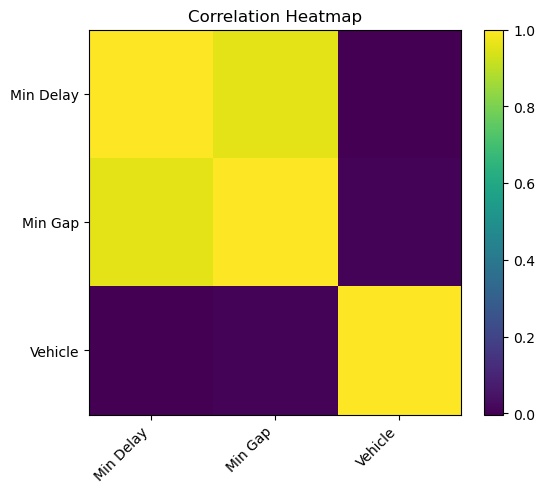
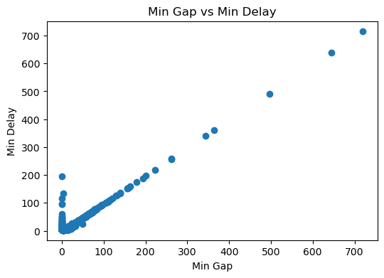

# Risk Analysis of TTC Delays

Data Science Institute, University of Toronto - Cohort 5 - Team Project 16

## Table of Contents

- [Requirements](#requirements)
- [Introduction](#introduction)
- [Objectives](#objectives)
- [Methodology](#methodology)
  - [1. Exploratory Data Analysis](#1-exploratory-data-analysis)
  - [2. Understanding the Raw Data](#2-understanding-the-raw-data)
  - [3. Data Cleaning and Processing](#3-data-cleaning-and-processing)
  - [4. Model Training and Development](#4-model-training-and-development)
  - [5. Model Selection](#5-model-selection)
- [Results](#results)
- [Members](#members)

## Requirements

## Introduction

## Objectives

## Methodology
To achieve our objective, we developed the following methodology:

### 1. Exploratory Data Analysis

**Load the Dataset:**  
We imported the data (from a CSV file) into a pandas DataFrame.

**Initial Investigation:**
- We inspected the dimensions of the dataset; the raw DataFrame had a shape of (28,571 rows × 10 columns).  
  
- We displayed the first few rows to understand the format and general structure. In this step, we identified our target variable: `Min Delay`, and our categorical features: [`Date`, `Time`, `Code`, `Bound`, `Line`, `Vehicle`].

**Descriptive Statistics:**
- We calculated summary statistics (mean, median, standard deviation) to gain insight into the distribution of each variable.  
  
- We looked for anomalies. In our case, `Min Delay` contains outliers (e.g., 700 minutes), while 75% of observations range between 1 and 18 minutes.  
  

**Visual Explorations:**

- **Potential Correlation in Min Gap and Min Delay**  
    
  

**Key Observations:**  
- **Correlation in Min Gap and Min Delay:** There is a strong correlation between these two features.  
- **Codes:** The delay codes will be grouped into a `category` column to help classify the delays.  
- **Missing Values:** Missing values will be handled in the Data Cleaning section.  
- **Feature with Low Importance:** The categorical feature `Vehicle` has low importance for our analysis.  
- **SRT Line:** The SRT line is out of scope because it is not in service.  
- **Note:** Only data from 2024 and 2025 was considered for this project.

###     2. Understanding the raw data

| Feature       | Description                                      |
|--------------|--------------------------------------------------|
| `Min Delay`  | The delay in minutes for each train.            |
| `Date`       | The date when the delay occurred.               |
| `Time`       | The time of the delay event.                    |
| `Code`       | The reason code assigned to the delay.          |
| `Bound`      | The direction in which the train was traveling. |
| `Line`       | The transit line on which the delay occurred.   |
| `Vehicle`    | The train number or identifier.                 |
| `Min Gap`   | The time in minutues for the next car           |

To understand the Codes, we analyze the [`ttc-subway-delay-codes.csv`](01_raw_data/ttc-subway-delay-codes.csv)

We have grouped the codes in categories, as shown in the following file: [`code_category_description.csv`](02_data_processing/code_category_description.csv)  

###     3. Data Celaning and Processing

###     4. Model Training and Development

###     5. Model Selection

## Results

## Members

- Julian Peinado

- Kuda Wamambo

- Olga Demenina

- Omer

- Rashita Makkar

