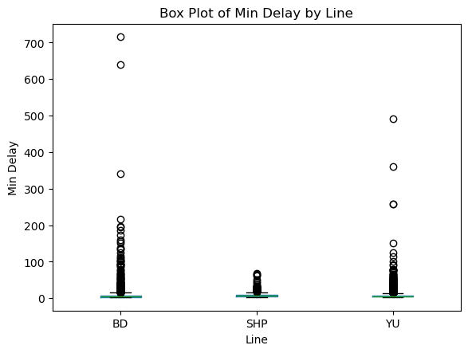

# Risk Analysis of TTC Delays

Data Science Institute, University of Toronto - Cohort 5 - Team Project 16

## Table of Contents

- [Requirements](#requirements)
- [Introduction](#introduction)
- [Objectives](#objectives)
- [Methodology](#methodology)
  - [1. Exploratory Data Analysis](#1-exploratory-data-analysis)
  - [2. Understanding the Raw Data](#2-understanding-the-raw-data)
  - [3. Data Cleaning and Processing](#3-data-cleaning-and-processing)
  - [4. Model Training and Development](#4-model-training-and-development)
  - [5. Model Selection](#5-model-selection)
- [Results](#results)
- [Members](#members)

## Requirements

## Introduction
As part of the Data Science Certificate program at the University of Toronto’s Data Sciences Institute, our capstone project focuses on analyzing TTC Subway Delay Data from 2024 and 2025. Combining advanced data science methodologies with our analytical expertise, we aim to solve a critical operational challenge: accurately classifying subway delay risks to enhance decision-making and operational effectiveness.
The central goal of this project is to build a predictive model that classifies delay risks at specific stations and subway lines, evaluating factors such as the month, day, and rush-hour timing.

## Objectives
- Develop a predictive classification model to determine subway delay risks.
- Analyze historical subway delay data to identify key factors influencing delays.
- Evaluate model accuracy and effectiveness in predicting delay risks.
- Provide actionable insights to stakeholders to support informed decision-making and operational improvements.
- Recommend strategies for real-time communication and operational adjustments based on model predictions.  

### Business Question
- Classification Problem: Based on available TTC delay data, can we accurately predict and classify the delays at given stations and subway lines, considering seasonal patterns, specific days, and peak commuting hours?

### Key Stakeholders and Project Impact
### TTC Management and Operations
- Enhanced Operational Efficiency: Accurate risk prediction enables optimized scheduling and strategic allocation of resources, significantly reducing costs and improving overall service reliability.
- Data-Driven Decision Making: Analytical insights facilitate strategic planning and informed investments in infrastructure upgrades and service adjustments.
- Improved Public Perception: Greater reliability directly enhances public trust and strengthens the TTC’s reputation.
### Transit Planners and Engineers
- Optimized Infrastructure Development: Clearly defined risk assessments guide planners in making targeted infrastructural and operational enhancements.
- Effective Resource Deployment: Enables proactive management of peak demand periods, ensuring smoother and more reliable transit services.
### Frontline Workers (Staff and Operations Teams)
- Balanced Workloads: Identifying high-risk periods allows for optimized staff scheduling, reducing stress and workload imbalances.
- Enhanced Safety Protocols: Insights on high-risk scenarios facilitate targeted safety training and preparedness measures, improving overall workforce safety.
- Improved Job Satisfaction: Better-managed operational conditions positively affect staff morale and productivity.
### Passengers and Commuting Public
- Reliability and Predictability: Passengers gain valuable insights that help them proactively manage their commute plans, minimizing inconveniences due to unexpected delays.
- Real-Time Commuter Support: The predictive model can integrate with real-time communication systems, enabling passengers to receive timely notifications and effectively plan alternative routes or departure times.
- Enhanced Commuter Satisfaction: Consistent and reliable service boosts overall customer satisfaction and fosters greater confidence in the TTC.
### City Government and Regulatory Authorities
- Informed Policy and Investment Decisions: Detailed analytical insights support strategic policy-making, funding allocation, and compliance with public transportation standards related to safety, efficiency, and sustainability.
- Future-Proof Urban Mobility: Enables long-term strategic planning aimed at enhancing urban transit systems to meet growing city demands.
### Data Analytics and Technology Partners
- Demonstrating Data Science Value: Highlights practical applications of advanced data science techniques to solve real-world transit challenges effectively.
- Driving Innovation: Promotes continuous improvement in predictive analytics, technological advancements, and operational efficiency within transit systems.
Our project, through rigorous analysis and predictive modeling, aims to deliver actionable insights that significantly improve the reliability and operational excellence of the TTC subway system, benefiting all involved stakeholders.

## Methodology
### 1. Exploratory Data Analysis

**Load the Dataset:**  
We imported the data (from a CSV file) into a pandas DataFrame. [`01_exploratory_data_analysis.csv`](02_data_processing/01_exploratory_data_analysis.ipynb)  

**Initial Investigation:**
- We inspected the dimensions of the dataset; the raw DataFrame had a shape of (28,571 rows × 10 columns).  
  
- We displayed the first few rows to understand the format and general structure. In this step, we identified our target variable: `Min Delay`, and our categorical features: [`Date`, `Time`, `Code`, `Bound`, `Line`, `Vehicle`].

**Descriptive Statistics:**
- We calculated summary statistics (mean, median, standard deviation) to gain insight into the distribution of each variable.  
  
- We looked for anomalies. In our case, `Min Delay` contains outliers (e.g., 700 minutes), while 75% of observations range between 1 and 18 minutes.  
  

**Visual Explorations:**

- **Potential Correlation in Min Gap and Min Delay**  
    
  

**Key Observations:**  
- **Correlation in Min Gap and Min Delay:** There is a strong correlation between these two features.  
- **Codes:** The delay codes will be grouped into a `category` column to help classify the delays.  
- **Missing Values:** Missing values will be handled in the Data Cleaning section.  
- **Feature with Low Importance:** The categorical feature `Vehicle` has low importance for our analysis.  
- **SRT Line:** The SRT line is out of scope because it is not in service.  
- **Note:** Only data from 2024 and 2025 was considered for this project.

###     2. Understanding the raw data

| Feature       | Description                                      |
|--------------|--------------------------------------------------|
| `Min Delay`  | The delay in minutes for each train.            |
| `Date`       | The date when the delay occurred.               |
| `Time`       | The time of the delay event.                    |
| `Code`       | The reason code assigned to the delay.          |
| `Bound`      | The direction in which the train was traveling. |
| `Line`       | The transit line on which the delay occurred.   |
| `Vehicle`    | The train number or identifier.                 |
| `Min Gap`   | The time in minutues for the next car           |

To understand the Codes, we analyze the [`ttc-subway-delay-codes.csv`](01_raw_data/ttc-subway-delay-codes.csv)

We have grouped the codes in categories, as shown in the following file: [`code_category_description.csv`](02_data_processing/code_category_description.csv)  

###     3. Data Cleaning and Processing

###     4. Model Training and Development

###     5. Model Selection

## Results

## Members

- Julian Peinado

- Kuda Wamambo

- Olga Demenina

- Omer Khan

- Rashita Makkar

