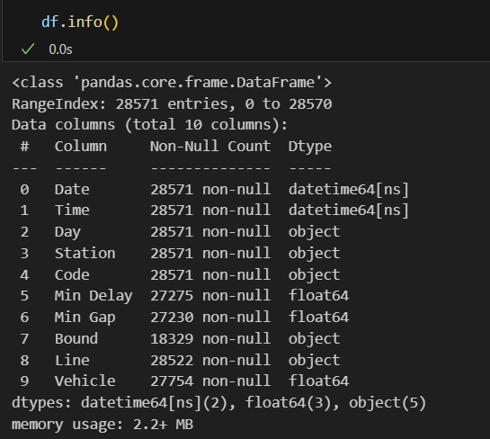
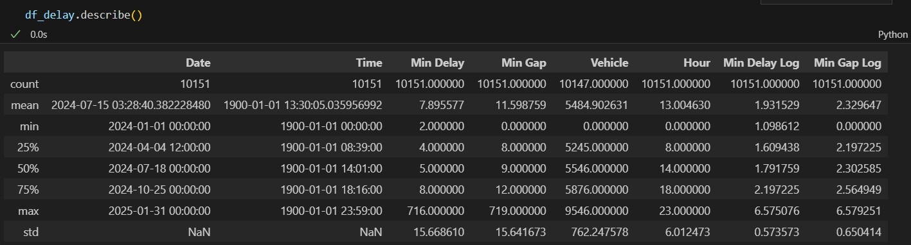
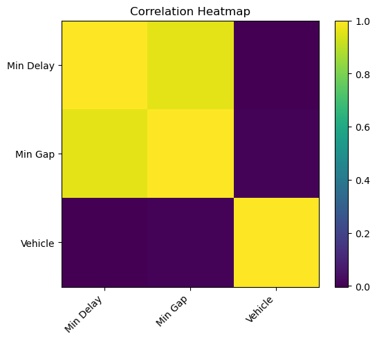
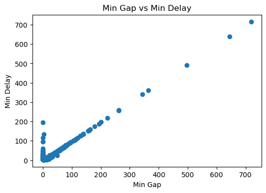

# Risk Analysis of TTC Delays

Data Science Institute, University of Toronto - Cohort 5 - Team Project 16

## Table of Contents

- [Requirements](#requirements)
- [Introduction](#introduction)
- [Objectives](#objectives)
- [Methodology](#methodology)
  - [1. Exploratory Data Analysis](#1-exploratory-data-analysis)
  - [2. Understanding the Raw Data](#2-understanding-the-raw-data)
  - [3. Data Cleaning and Processing](#3-data-cleaning-and-processing)
  - [4. Model Training and Development](#4-model-training-and-development)
  - [5. Model Selection](#5-model-selection)
- [Results](#results)
- [Members](#members)

## Requirements

| **Library**     | **Purpose**                                                                                   |
|-----------------|-----------------------------------------------------------------------------------------------|
| **Pandas**      | For data manipulation and analysis.                                                           |
| **NumPy**       | For numerical operations and handling arrays.                                                 |
| **scikit-learn**| For building and evaluating machine learning models.                                          |
| **matplotlib**  | For creating visualizations like charts and plots.                                            |
| **Seaborn**     | For statistical data visualization and creating complex visualizations easily.                |
| **SHAP**        | For model explainability, analyzing how individual features contribute to model predictions.  |

## Introduction
As part of the Data Science Certificate program at the University of Toronto’s Data Sciences Institute, our capstone project focuses on analyzing TTC Subway Delay Data from 2024 and 2025. Combining advanced data science methodologies with our analytical expertise, we aim to solve a critical operational challenge: accurately classifying subway delay risks to enhance decision-making and operational effectiveness.
The central goal of this project is to build a predictive model that classifies delay risks at specific stations and subway lines, evaluating factors such as the month, day, and rush-hour timing.

## Objectives
- Develop a predictive classification model to determine subway delay risks.
- Analyze historical subway delay data to identify key factors influencing delays.
- Evaluate model accuracy and effectiveness in predicting delay risks.
- Provide actionable insights to stakeholders to support informed decision-making and operational improvements.
- Recommend strategies for real-time communication and operational adjustments based on model predictions.  
-	What are the most common causes of subway delays?
-	How do delay patterns vary by time of day or day of the week?
-	Are there any seasonal trends in subway delays?
-	How do delays impact ridership and customer satisfaction?

### Business Question
- Classification Problem: Based on available TTC delay data, can we accurately predict and classify the delays at given stations and subway lines, considering seasonal patterns, specific days, and peak commuting hours?

### Key Stakeholders and Project Impact
### TTC Management and Operations
- Enhanced Operational Efficiency: Accurate risk prediction enables optimized scheduling and strategic allocation of resources, significantly reducing costs and improving overall service reliability.
- Data-Driven Decision Making: Analytical insights facilitate strategic planning and informed investments in infrastructure upgrades and service adjustments.
- Improved Public Perception: Greater reliability directly enhances public trust and strengthens the TTC’s reputation.
### Transit Planners and Engineers
- Optimized Infrastructure Development: Clearly defined risk assessments guide planners in making targeted infrastructural and operational enhancements.
- Effective Resource Deployment: Enables proactive management of peak demand periods, ensuring smoother and more reliable transit services.
### Frontline Workers (Staff and Operations Teams)
- Balanced Workloads: Identifying high-risk periods allows for optimized staff scheduling, reducing stress and workload imbalances.
- Enhanced Safety Protocols: Insights on high-risk scenarios facilitate targeted safety training and preparedness measures, improving overall workforce safety.
- Improved Job Satisfaction: Better-managed operational conditions positively affect staff morale and productivity.
### Passengers and Commuting Public
- Reliability and Predictability: Passengers gain valuable insights that help them proactively manage their commute plans, minimizing inconveniences due to unexpected delays.
- Real-Time Commuter Support: The predictive model can integrate with real-time communication systems, enabling passengers to receive timely notifications and effectively plan alternative routes or departure times.
- Enhanced Commuter Satisfaction: Consistent and reliable service boosts overall customer satisfaction and fosters greater confidence in the TTC.
### City Government and Regulatory Authorities
- Informed Policy and Investment Decisions: Detailed analytical insights support strategic policy-making, funding allocation, and compliance with public transportation standards related to safety, efficiency, and sustainability.
- Future-Proof Urban Mobility: Enables long-term strategic planning aimed at enhancing urban transit systems to meet growing city demands.
### Data Analytics and Technology Partners
- Demonstrating Data Science Value: Highlights practical applications of advanced data science techniques to solve real-world transit challenges effectively.
- Driving Innovation: Promotes continuous improvement in predictive analytics, technological advancements, and operational efficiency within transit systems.
Our project, through rigorous analysis and predictive modeling, aims to deliver actionable insights that significantly improve the reliability and operational excellence of the TTC subway system, benefiting all involved stakeholders.

## Methodology
### 1. Exploratory Data Analysis

**Load the Dataset:**  
We imported the data (from a CSV file) into a pandas DataFrame. [`01_exploratory_data_analysis.csv`](/01_exploratory_data_analysis/01_exploratory_data_analysis.ipynb)  

**Initial Investigation:**
- We inspected the dimensions of the dataset; the raw DataFrame had a shape of (28,571 rows × 10 columns).  
  
- We displayed the first few rows to understand the format and general structure. In this step, we identified our target variable: `Min Delay`, and our categorical features: [`Date`, `Time`, `Code`, `Bound`, `Line`, `Vehicle`].

**Descriptive Statistics:**
- We calculated summary statistics (mean, median, standard deviation) to gain insight into the distribution of each variable.  
  
- We looked for anomalies. In our case, `Min Delay` contains outliers (e.g., 700 minutes), while 75% of observations range between 1 and 18 minutes.  
  

**Visual Explorations:**

- **Potential Correlation in Min Gap and Min Delay**  
    
  

**Key Observations:**  
- **Correlation in Min Gap and Min Delay:** There is a strong correlation between these two features.  
- **Codes:** The delay codes will be grouped into a `category` column to help classify the delays.  
- **Missing Values:** Missing values will be handled in the Data Cleaning section.  
- **Feature with Low Importance:** The categorical feature `Vehicle` has low importance for our analysis.  
- **SRT Line:** The SRT line is out of scope because it is not in service.  
- **Note:** Only data from 2024 and 2025 was considered for this project.

###     2. Understanding the raw data

| Feature       | Description                                      |
|--------------|--------------------------------------------------|
| `Min Delay`  | The delay in minutes for each train.            |
| `Date`       | The date when the delay occurred.               |
| `Time`       | The time of the delay event.                    |
| `Code`       | The reason code assigned to the delay.          |
| `Bound`      | The direction in which the train was traveling. |
| `Line`       | The transit line on which the delay occurred.   |
| `Vehicle`    | The train number or identifier.                 |
| `Min Gap`   | The time in minutues for the next car           |

To understand the Codes, we analyze the [`ttc-subway-delay-codes.csv`](/data/raw_data/ttc-subway-delay-codes.csv)

We have grouped the codes in categories, as shown in the following file: [`code_category_description.csv`](/data/raw_data/code_category_description.csv)  

* Date Range: Jan, 01 2024 to Jan 31, 2025
* Company:The Toronto subway, operated by the TTC (Toronto Transit Commission), consists of three lines: Line 1 (Yonge-University), Line 2 (Bloor-Danforth), and Line 4 (Sheppard). 
* Data Points: 28,571 entries 
* Adjustments: 17,653 entries in dataset 'df_delay.csv'
* Additional source: 'code_category_description.csv' (130 entries)

Based on typical delay datasets, expect columns like:

- Date and Time: Indicates when the delay occurred.
- Station: Specifies the station where the delay happened.
- Duration (Min Delay): Describes the length of the delay.
- Reason/Category: Explains the cause of the delay (e.g., mechanical, weather).
- Line: Identifies the subway line affected.
- Category: Describes the categories associated with the codes that specify the underlying reasons for TTC delays

Tis file  categorize various delay codes related to transportation operations. 

Categories :
* Mechanical/Electrical/Vehicle Equipment: Issues like HVAC malfunctions (EUAC), brake problems (EUBK), or door sensor failures (EUDO).
* Signaling/Communication/Power: Problems such as signal control failures (PUCSC) or traction power distribution issues (PUTTP).
* Track/Infrastructure/Debris: Includes track-level debris (PUTD) and structural problems at stations or tunnels (PUTS).
* Operations/Staffing/Scheduling: Delays caused by staff shortages (MUESA) or scheduling errors (MUCL).
* Door/Passenger/Platform Incidents: Situations like doors blocked by debris (MUDD) or passengers interfering with train operations (MUD).
* Weather/External: Delays due to severe weather events (MUFM) or snow buildup (PUTIS).
* Medical/Injury/Safety: Instances involving ill passengers or injuries, both for staff and passengers (MUI, MUIE).
* Security/Policing: Emergency situations such as unauthorized individuals on tracks (SUUT) or vandalism (SUG).
* Transportation/Operator: Operator-related issues like overshooting platforms (TUOS) or procedural errors (TUATC).
* Miscellaneous: General or uncategorized delays (MUGD).

###     3. Data Cleaning and Processing

Data Cleaning for the Team Project TTC Delay

This code prepares the data for analysis by merging datasets for period Jan, 01, 2024 to Jan 31, 2025, cleaning up unnecessary columns, and standardizing date formats. It sets the foundation for further exploration and visualization of TTC subway delays.
The  the result for years 2024 and 2025 datasets are concatenated into a single DataFrame named 'df_delay.csv' and saved at directory  '../data/processed_data/df_delay.csv'.

Files Used:
1. ttc-subway-delay-data-2024.csv:
 - this file contains TTC subway delay data for the year 2024.
 - it is loaded into a DataFrame named df_2024 using pd.read_csv().

2. TTC Subway Delay Data since 2025.csv:
 - this file contains TTC subway delay data for month of January of 2025.

3. code_category_description.csv 
- file to categorize various delay codes related to transportation operations

###     4. Model Training and Development

The model is trained with Logistic regression model.
The  testcase saved at directory   '../02_data_processing/02_model_training.ipynb'.

###     5. Model Selection

**1. Binary Classification Focus**  
The primary aim of the model is to determine whether a particular outcome (e.g., delay vs. no delay) will occur. Logistic Regression is specifically designed for binary classification, mapping inputs to a probability between 0 and 1. As such, it aligns well with scenarios where the dependent variable is a yes/no or true/false type of outcome.

**2. Suitability for Categorical Predictors**  
A significant portion of the dataset consists of categorical variables. Logistic Regression readily handles categorical data through encoding techniques such as one-hot encoding. This approach permits the model to learn how each category influences the log-odds of the target outcome. Furthermore, the model’s observed accuracy suggests that the chosen encoding and feature preparation steps effectively leverage the categorical information.

**3. Model Interpretability**  
Unlike certain more complex methods (e.g., neural networks or ensemble models), Logistic Regression offers transparent coefficients indicating the contribution of each feature (or category) to the probability of the outcome. This characteristic supports clearer communication of model results to non-technical stakeholders, fostering trust and understanding in how decisions are reached.

**4. Computational Efficiency**  
Compared to other classification algorithms, Logistic Regression is relatively fast to train and update. This efficiency is particularly beneficial for projects that require frequent re-training or real-time analytics, as it reduces both computational overhead and latency during predictive operations.

**5. Probability Outputs**  
Logistic Regression natively produces probability estimates, which facilitate a granular understanding of the model’s confidence in each classification. This feature also allows practitioners to adjust the classification threshold as needed, depending on the balance of priorities, such as sensitivity vs. specificity.

**6. Resilience to Data Imperfections**  
When combined with regularization, Logistic Regression can handle moderate levels of noise and outliers. The model’s performance indicates that any violations of assumptions (e.g., perfect linear separability) are not severe enough to impede accuracy, affirming its suitability within the current data context.

**Conclusion**  
Given the project’s focus on a binary outcome, the presence of numerous categorical features, and the need for both interpretability and computational efficiency, Logistic Regression emerges as a strong methodological choice. The decent accuracy achieved further validates its effectiveness for this classification task.

The model is trained with Logistic regression model.

Create a model pipeline - steps to perform:
* Split the dataset into training and testing subsets 
* Defining transformations for numeric features
* Defining transformations for categorical features
* Add a step labelled 'preprocessor' and assign the ColumnTransformer from the previous section.
* Import the Logistic Regression model from scikit-learn
* Initialize the Logistic Regression model with a random state for reproducibility
* Calculate the accuracy of the model on the test dataset
* Visualize the importance of the model features

## Results

After the processing according to results based on testing set the model correctly classified approximately as 61.20% of the instances in the test set.
The analysis of feature importance from the model highlights several key factors that significantly contribute to TTC delays. Each of these factors is discussed below to provide insights into their influence:

[Model_Results](/img/02_results/03_model_features.png)

 - Min Gap
 - Bound
 - Line
 - Category of incident
 - Day if the week
 - Month 

* Min Gap: The "Min Gap" feature reflects the interval between consecutive trains. A smaller or irregular gap can lead to congestion on the line, increasing the likelihood of delays. This variable’s high importance suggests that maintaining consistent train intervals is critical for mitigating delays and ensuring smooth operations.

* The Cagetgories having the max impact of TTS dealay are:
- Doors/Passengers/Platform Incidents
- Medical Injuries/Safety
- Safety/Policing
- Infracstructure/Debries
The delays realted to those categories causing service interruptions during the process

* Line 'SHP' (Sheppard) - identified as the most impacted by delays. This could be attributed to the line's operational characteristics, such as fewer trains or limited infrastructure capacity, making it more sensitive to disruptions.

* Day of the Week - Saturday: The model identified Saturdays as a key day for increased delays. This trend may be attributed to higher maintenance works done during weekends, coupled with a reduced service schedule, making the system more susceptible to disruptions.

* Month - July: The month of July stands out as a period with heightened delays. This could be due to seasonal factors, such as increased tourism or special events, which elevate passenger volumes. Additionally, weather conditions such as summer storms may impact service reliability during this time.

* Based on the Paretto Chart and wroking with the clean data, we could identify the categories that causes the 80% of our delays.

The 80% of the delays are caused by:

- Security/Policing Issues
- Door/Passenger/Platform Incidents
- Signaling/Communication/Power
- Medical/Injury/Safety
- Transportation/Operator

* Top 10 Dealy Average in min by Station

* Top 10 Delay Average in min by Category

* Top 10 Delay Average in min by Month

* There is a strong linear regression correlation between the Delay and the Gap numeric variables

[LR_Delay_Gap](/img/02_results/04_linear_regression_correlation.jpg)

**Conclusion:**
The findings underscore the multifaceted nature of TTC delays, influenced by operational, behavioral, and temporal factors. To address these issues, targeted strategies such as improving passenger education, optimizing train schedules, and enhancing track and platform maintenance can be implemented. Recognizing the prominence of specific days and months in contributing to delays also enables more efficient allocation of resources to manage anticipated disruptions.

## Members

- Julian Peinado

- Kuda Wamambo

- Olga Demenina

- Omer Khan

- Rashita Makkar

